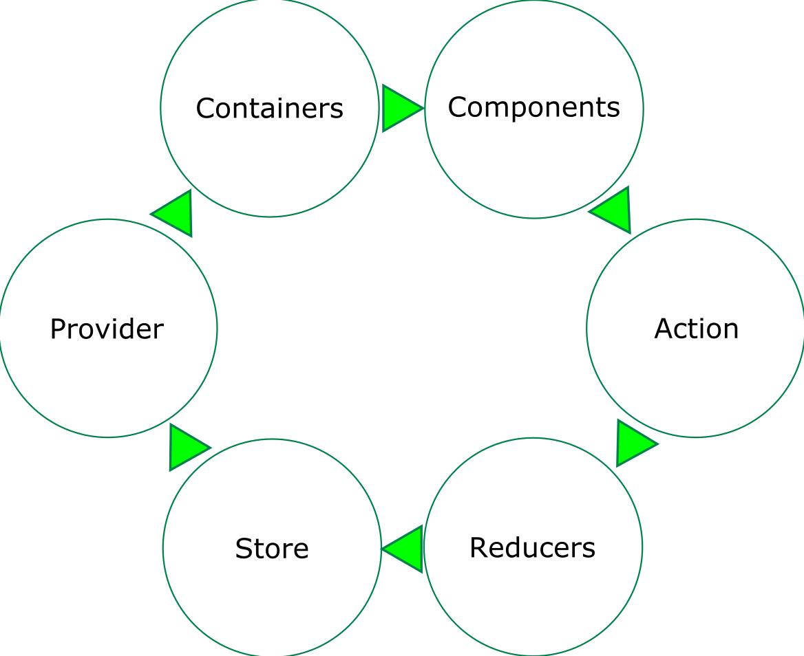

# Team Gilbraltar
#### Presents
<div>
<span>


</span>
</div>
#### Created By:
Randy && Haiden

---

# What is React?
* React is component based JavaScript UI Framework.
* React takes a composition approach to create reusable UI components.
* A component has an idea of a state or prop. A state represents a components data, primitive values, and react elements/functions.

---

### What about Inheritance?
>At Facebook, we use React in thousands of components, and we haven’t found any use cases where we would recommend creating component inheritance hierarchies.

---

#### What do we love about it?
 ES6 SYNTAX
* Template Strings
 ```
    `Hello ${user.name}`
 ```    
* Fat Arrow Functions
 ```
    => () {return true}
 ``` 
* Literals: Let and Const

# JSX
* Html Literals

---

# What is Redux?

#### Redux is a predictable state container for JavaScript apps.

- Why would we use redux?
    * It is tiny (2kB, including dependencies).
    * The state of your app is stored in an object tree inside a single store.

---

#### Redux and it's opinions

* Redux provides the idea of:
    * Global Store, Actions and a Reducer
* The Global Store is a immutable object of the entire application.
* Actions specify the mutations that need to occur to the Store.
* Reducers decides what and how a specific Action transforms the entire applications state.

---
### React-Redux Cycle

<div>
    
</div>


---

#### Why do we think its cool?

* Powerful Developer Tools
    * The state of you application is now held accountable by Actions.
    * You can trace or debug by replicating those actions.
    * We can now make better and more complex choices in our application.

---
## File Structures

* Focus on two basic file structures
    * Modular Components
    * Redux Organization

---

## File Structure - Base
<pre class='no-borders tree'>
React-Redux Project
│   package.json    | Records project info + project dependencies
│   README.md       | Documentation
│                   |
├───node_modules    | Stores all dependency folders
│
├───src
│   │   index.html
│   │   index.js
│   │   store.js
.
.
.
</pre>

<!--v-->

## File Structure - Modular
<pre class='no-borders tree'>

.  src
.   │
.   │
│   ├───styles 
│   │
│   └───Components
│       ├───app
│       │
│       ├───componentA
│       .           _componentA 
│       .           componentA-actions
│       .           componentA-reducer
│                   componentA
├───static
│   └───images
│
└───webpack
</pre>

<!--v-->

## File Structure - Redux
<pre class='no-borders'>
.  src
.   │
.   ├───styles
│   │
│   ├───actions
│   │
│   ├───Reducers
│   │
│   └───components
│       ├───app
│       │
│       └───componentA
│       .           _componentA
│       .           componentA
│       .
│
├───static
│   └───images
│
└───webpack
</pre>

---

<!-- Was thinking it would be cool to show how many React projects we have -->
## Projects that use React + Redux
* Portal
* DIET
* Tank Vapors
* Other React Projects
    * Beau
    * John
    * Juan
    * Nick
    * Patrick
    * Laura
    * Heather?
    * Trevor?
    * Haiden
    * Randy
* Grow

---

## Resources
* [npmjs](www.npmjs.com)
* [React](github.com/facebook/react)
* [Redux](github.com/buckyroberts/React-Redux-Boilerplate)

---

# Questions?